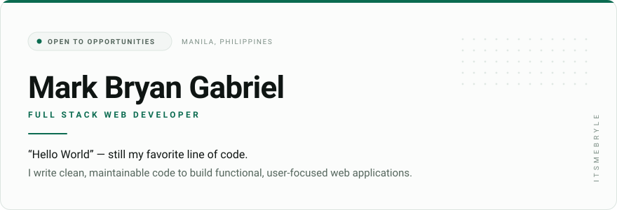
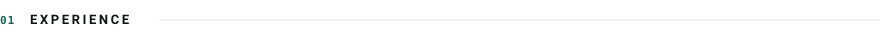
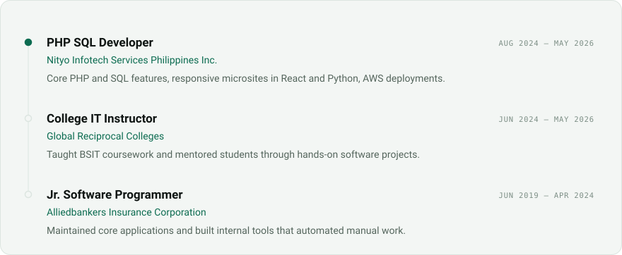
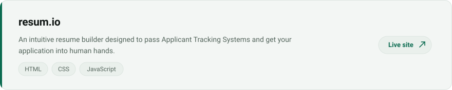
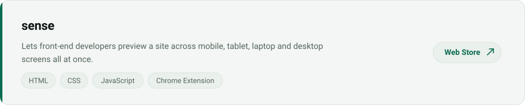
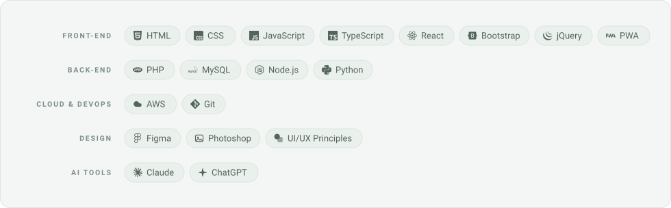

<picture>
  <source media="(prefers-color-scheme: dark)" srcset="assets/hero-dark.svg">
  <source media="(prefers-color-scheme: light)" srcset="assets/hero-light.svg">
  
</picture>

<a href="https://itsmebryle.com">
  <picture>
    <source media="(prefers-color-scheme: dark)" srcset="assets/btn-portfolio-dark.svg">
    <source media="(prefers-color-scheme: light)" srcset="assets/btn-portfolio-light.svg">
    
  </picture>
</a>
<a href="mailto:mrkbryngbrl@gmail.com">
  <picture>
    <source media="(prefers-color-scheme: dark)" srcset="assets/btn-email-dark.svg">
    <source media="(prefers-color-scheme: light)" srcset="assets/btn-email-light.svg">
    
  </picture>
</a>
<a href="https://github.com/mgabriel23?tab=repositories">
  <picture>
    <source media="(prefers-color-scheme: dark)" srcset="assets/btn-repos-dark.svg">
    <source media="(prefers-color-scheme: light)" srcset="assets/btn-repos-light.svg">
    
  </picture>
</a>

<picture>
  <source media="(prefers-color-scheme: dark)" srcset="assets/section-experience-dark.svg">
  <source media="(prefers-color-scheme: light)" srcset="assets/section-experience-light.svg">
  
</picture>

<picture>
  <source media="(prefers-color-scheme: dark)" srcset="assets/experience-dark.svg">
  <source media="(prefers-color-scheme: light)" srcset="assets/experience-light.svg">
  
</picture>

<picture>
  <source media="(prefers-color-scheme: dark)" srcset="assets/section-projects-dark.svg">
  <source media="(prefers-color-scheme: light)" srcset="assets/section-projects-light.svg">
  
</picture>

<a href="https://resume.itsmebryle.com/">
  <picture>
    <source media="(prefers-color-scheme: dark)" srcset="assets/project-1-dark.svg">
    <source media="(prefers-color-scheme: light)" srcset="assets/project-1-light.svg">
    
  </picture>
</a>

<a href="https://chromewebstore.google.com/search/sense%20multi%20screen%20preview">
  <picture>
    <source media="(prefers-color-scheme: dark)" srcset="assets/project-2-dark.svg">
    <source media="(prefers-color-scheme: light)" srcset="assets/project-2-light.svg">
    
  </picture>
</a>

<picture>
  <source media="(prefers-color-scheme: dark)" srcset="assets/section-skills-dark.svg">
  <source media="(prefers-color-scheme: light)" srcset="assets/section-skills-light.svg">
  
</picture>

<picture>
  <source media="(prefers-color-scheme: dark)" srcset="assets/skills-dark.svg">
  <source media="(prefers-color-scheme: light)" srcset="assets/skills-light.svg">
  
</picture>

<picture>
  <source media="(prefers-color-scheme: dark)" srcset="assets/section-connect-dark.svg">
  <source media="(prefers-color-scheme: light)" srcset="assets/section-connect-light.svg">
  
</picture>

<picture>
  <source media="(prefers-color-scheme: dark)" srcset="assets/connect-dark.svg">
  <source media="(prefers-color-scheme: light)" srcset="assets/connect-light.svg">
  
</picture>

Prefer plain text? Expand the text version.

**Mark Bryan Gabriel** — Full Stack Web Developer  
Manila, Philippines · [itsmebryle.com](https://itsmebryle.com) · [mrkbryngbrl@gmail.com](mailto:mrkbryngbrl@gmail.com)  
_Open to opportunities._

**Experience**

- **PHP SQL Developer**, Nityo Infotech Services Philippines Inc. — Aug 2024 — May 2026  
  Core PHP and SQL features, responsive microsites in React and Python, AWS deployments.
- **College IT Instructor**, Global Reciprocal Colleges — Jun 2024 — May 2026  
  Taught BSIT coursework and mentored students through hands-on software projects.
- **Jr. Software Programmer**, Alliedbankers Insurance Corporation — Jun 2019 — Apr 2024  
  Maintained core applications and built internal tools that automated manual work.

**Projects**

- **[resum.io](https://resume.itsmebryle.com/)** (HTML, CSS, JavaScript) — An intuitive resume builder designed to pass Applicant Tracking Systems and get your application into human hands.
- **[sense](https://chromewebstore.google.com/search/sense%20multi%20screen%20preview)** (HTML, CSS, JavaScript, Chrome Extension) — Lets front-end developers preview a site across mobile, tablet, laptop and desktop screens all at once.

**Skills**

- **Front-end:** HTML, CSS, JavaScript, TypeScript, React, Bootstrap, jQuery, PWA
- **Back-end:** PHP, MySQL, Node.js, Python
- **Cloud & DevOps:** AWS, Git
- **Design:** Figma, Photoshop, UI/UX Principles
- **AI Tools:** Claude, ChatGPT

Designed and built by Mark Bryan Gabriel. Assets generated from <code>build.py</code> — edit <code>content.py</code> and re-run to update.
