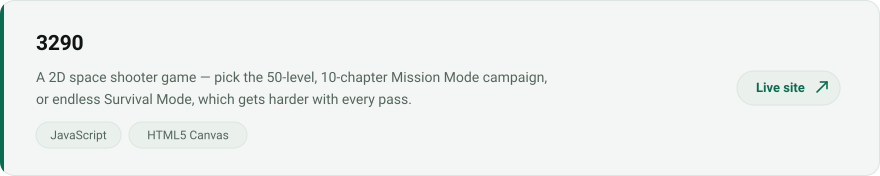

<picture>
  <source media="(prefers-color-scheme: dark)" srcset="assets/hero-dark.svg">
  <source media="(prefers-color-scheme: light)" srcset="assets/hero-light.svg">
  
</picture>

<a href="https://itsmebryle.com">
  <picture>
    <source media="(prefers-color-scheme: dark)" srcset="assets/btn-portfolio-dark.svg">
    <source media="(prefers-color-scheme: light)" srcset="assets/btn-portfolio-light.svg">
    
  </picture>
</a>

<picture>
  <source media="(prefers-color-scheme: dark)" srcset="assets/section-experience-dark.svg">
  <source media="(prefers-color-scheme: light)" srcset="assets/section-experience-light.svg">
  
</picture>

<picture>
  <source media="(prefers-color-scheme: dark)" srcset="assets/experience-dark.svg">
  <source media="(prefers-color-scheme: light)" srcset="assets/experience-light.svg">
  
</picture>

<picture>
  <source media="(prefers-color-scheme: dark)" srcset="assets/section-projects-dark.svg">
  <source media="(prefers-color-scheme: light)" srcset="assets/section-projects-light.svg">
  
</picture>

<a href="https://3290.itsmebryle.com/">
  <picture>
    <source media="(prefers-color-scheme: dark)" srcset="assets/project-3-dark.svg">
    <source media="(prefers-color-scheme: light)" srcset="assets/project--light.svg">
    
  </picture>
</a>

<a href="https://chromewebstore.google.com/search/sense%20multi%20screen%20preview">
  <picture>
    <source media="(prefers-color-scheme: dark)" srcset="assets/project-2-dark.svg">
    <source media="(prefers-color-scheme: light)" srcset="assets/project-2-light.svg">
    
  </picture>
</a>

<a href="https://resume.itsmebryle.com/">
  <picture>
    <source media="(prefers-color-scheme: dark)" srcset="assets/project-1-dark.svg">
    <source media="(prefers-color-scheme: light)" srcset="assets/project-1-light.svg">
    
  </picture>
</a>

<picture>
  <source media="(prefers-color-scheme: dark)" srcset="assets/section-skills-dark.svg">
  <source media="(prefers-color-scheme: light)" srcset="assets/section-skills-light.svg">
  
</picture>

<picture>
  <source media="(prefers-color-scheme: dark)" srcset="assets/skills-dark.svg">
  <source media="(prefers-color-scheme: light)" srcset="assets/skills-light.svg">
  
</picture>

<picture>
  <source media="(prefers-color-scheme: dark)" srcset="assets/section-connect-dark.svg">
  <source media="(prefers-color-scheme: light)" srcset="assets/section-connect-light.svg">
  
</picture>

<picture>
  <source media="(prefers-color-scheme: dark)" srcset="assets/connect-dark.svg">
  <source media="(prefers-color-scheme: light)" srcset="assets/connect-light.svg">
  
</picture>
